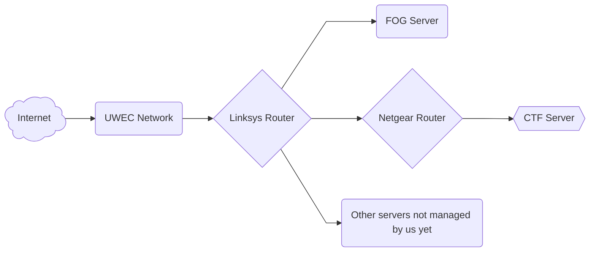

# Cybersecurity Lab

We are located in Vicki Lord Larson 1132 (between Schofield and the Library) where we have 4 racks of running equipment and two cabinets of other things. <!-- need better way to describe the things we have in our cabinets --> 

---

## Network Diagram

Outlined below is a flowchart representing the basic diagram of our in-lab network. A few things to note that aren't detailed in the flowchart are:

- The Netgear router is the only wireless access point in the system.
- The Linksys router acts as a barrier/firewall to create a "VLAN" within the UWEC network isolating the lab. This way, everything that happens in the lab, stays in the lab.
- Our CTF server is also isolated from the rest of the lab network using the Netgear router in a similar fashion.

 
